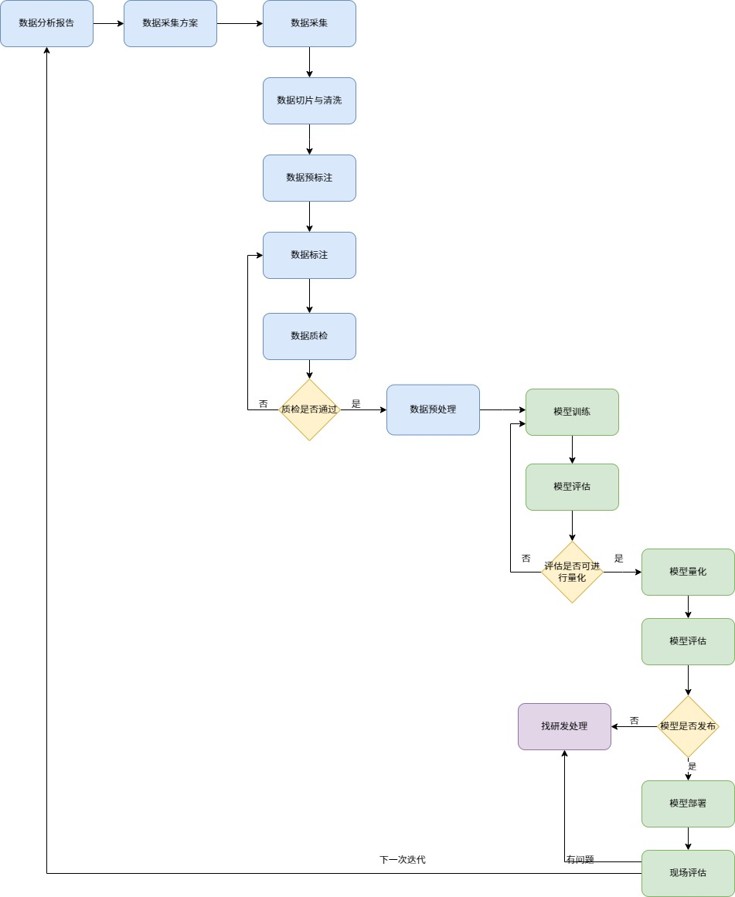

# AI模型训练标准化流程规范

本文档描述了从数据采集、数据处理、模型训练到模型部署的标准全流程。它将原有的杂乱脚本分类整合到标准化的 8 个工作阶段中，使每个脚本都能严密地对应到流程图中的具体节点。

## 整体业务流程图

---

## 流程各阶段详解及对应脚本

### 01 数据采集与切片清洗
*对应流程图节点：数据分析报告 -> 数据采集方案 -> 数据采集 -> 数据切片与清洗*

**阶段说明：** 
该阶段包括线下制定数据采集方案并实际采集数据（包括录制视频和拍摄图片）。之后，将原始数据通过脚本进行切片抽帧、过滤、分辨率规范化处理，产出干净的基础图库。

**涉及脚本（位于 `01_数据采集与切片清洗/`）：**
- `mp4cimg.py`：对采集到的视频进行等间距抽帧，提取图片。
- `dedup.py`：用于原始图库的文件去重清理。
- `realJPG.py`：校验并转换图片格式为真实的 `.jpg`。
- `remove_chinese_filenames.py`：自动重命名含有中文的图片文件名，防止后续训练报错。
- `resize_images_1920x1080.py`：将各种尺寸的图片统一缩放至 1920x1080 尺寸。
- `filer_file_gamma.py`：过滤并剔除曝光异常（包含 gamma 关键字）的图片。
- `filter_file_thumbnail.py`：过滤掉质量差或过小的缩略图。
- `delete_img.py` / `delete_skip.py`：辅助删除不需要的切片。
- `distribute_images.py`：将大量清洗后的图片平均分配给多个标注人员。

**数据流转：**
`原始视频/图片源` -> (切片清洗脚本群) -> `高质量规范化 JPG 图片集`。

---

### 02 数据预标注
*对应流程图节点：数据预标注*

**阶段说明：** 
利用现有的 YOLO 模型或 VLM（大语言视觉模型）对新收集的干净图库进行一次自动化预测标注，生成含有初步目标的 JSON 文件，从而大幅降低后续人工标注的时间成本。

**涉及脚本（位于 `02_数据预标注/`）：**
- `yolo_preannotate/` 及 `train_pre_annotate.py`：加载已训练的旧版 YOLO 模型，对新图片进行推理并导出预标注结果。
- `vlm_preannotate/`：使用 VLM 大模型进行更复杂的理解性预标注。
- `convert_to_preannotate.py`：负责转换预标注结果的格式，以适配后续平台导入。
- `run_all_preannotate.py`：一键驱动全部图片预标注的主入口。
- `labelu_download_images/`：从 LabelU 平台下载原始图片/已标注图片资源，作为预标注或后续处理的数据基础。

**数据流转：**
`高质量图片集` + `历史模型` -> (预标注脚本) -> `LabelU 兼容的预标注 JSON 文件`。

---

### 03 数据标注
*对应流程图节点：数据标注*

**阶段说明：** 
标注人员在 LabelU 等在线标注平台上进行人工复核，调整预标注错误，并补充遗漏目标。此处的脚本主要辅助于平台任务的管理。

**涉及脚本（位于 `03_数据标注辅助/`）：**
- `labelu_copy_config_to_task.py`：自动化同步 LabelU 项目的任务配置。
- `count_undo.py` / `labelu_undo_count/`：统计尚未完成标注的任务数量，追踪进度（后者为支持配置的高级版）。
- `labelu_delete/`：用于从平台批量删除无效或错误任务的高级工具包。
- `labelu_recttool_unify/`：对齐和同步矩形框标注工具配置。

**数据流转：**
`预标注 JSON` -> (人工复核与修改) -> `平台导出的最终标注 JSON 文件`。

---

### 04 数据质检与分析
*对应流程图节点：数据质检 -> 质检是否通过*

**阶段说明：** 
由于人工操作可能引发各类低级错误（如漏标、多标、平台bug导致的字段缺失），在投入训练前必须对平台导出的标注数据进行全方位的质检和格式修复。

**涉及脚本（位于 `04_数据质检与分析/`）：**
- `01_convert_annotations.py`：将 LabelU JSON 转换为 YOLO 训练更兼容的 VOC XML 格式。
- `02_fix_problem_json.py`：修复标注文件中大小写拼写错误、非法类别等问题。
- `03_iamgesLabels配对检测.py`：严格检验每张图是否都有对应的 XML，每个 XML 是否都有对应的图。
- `04_size元素为空检查.py`：补充 XML 中缺失的图片分辨率节点信息。
- `05_size为0删除.py`：删除宽高均为 0 的无效目标框。
- `06_检查object是否为空.py`：清理内部无任何目标标签的 XML 文件。
- `07_标签数量检查.py`：统计修复后的各类标签总量是否达到预期。
- `08_data_analysis.py`：一键生成整个数据集的质量分析报告与特征分布图表。
- `09_检查filename.py`：确保 XML 内部的 `<filename>` 值与外部实际名称完全一致。
- `labelu_tagtool_check/`：针对 LabelU 平台的标签校验与质检高级工具包。
- `labelu_tagtool_unify/`：自动修正并统一标签工具配置参数。
- `labelu_tool_unify/`：LabelU 平台整体配置对齐工具包。

**数据流转：**
`平台导出的 JSON` -> (质检与修复流水线) -> `无报错的可靠图文对 (JPG + XML)`。

---

### 05 数据预处理
*对应流程图节点：数据预处理*

**阶段说明：** 
将质检通过的原始数据集按特定比例（如 7:2:1）划分为训练集、验证集和测试集，并转换为目标检测框架（如 YOLO）直接读取的结构。

**涉及脚本（位于 `05_数据预处理/`）：**
- `01_merge_team_data.py`：将多位标注人员的独立数据与 JSON 合并、防止同名冲突。
- `02_clean_data.py`：执行最终的图片剔除与 XML 合法性检查清理。
- `preImages.py` / `prepare_yolo_dataset.py`：执行数据集随机切分，生成 YOLO 的 TXT 标签并创建 `dataset.yaml` 配置文件。

**数据流转：**
`可靠图文对 (JPG + XML)` -> (预处理脚本) -> `YOLO 训练目录结构 (images/, labels/, dataset.yaml)`。

---

### 06 模型训练
*对应流程图节点：模型训练*

**阶段说明：** 
正式加载预处理好的数据进行深度学习模型训练。

**涉及脚本（位于 `06_模型训练/`）：**
- `train.py`：YOLO 训练主启动脚本。
- `train.yaml`：设定超参数（学习率、Epochs、BatchSize、类别名等）。

**数据流转：**
`YOLO 训练目录结构` -> (训练脚本) -> `best.pt 模型权重`。

---

### 07 模型评估
*对应流程图节点：模型评估 -> 评估是否可进行量化*

**阶段说明：** 
评估训练产出的模型在测试集上的真实表现。不仅看 mAP 等全局指标，还需要分场景、分目标尺寸进行细粒度分析，以及挖掘失败案例。

**涉及脚本（位于 `07_模型评估/`）：**
- `cloud_based_evaluation.py`：基于 GPU 产出详尽的多维度模型表现报告。
- `failure_mining_yolo.py`：坏案（False Positives, False Negatives）挖掘脚本，用于分析误检与漏检。
- `threshold_grid_eval.py`：暴力搜索最佳置信度与 NMS 阈值。
- `evaluation_utils.py`：评估环节依赖的核心工具库。

**数据流转：**
`best.pt 模型权重` + `test.yaml 测试集` -> (评估脚本) -> `多维度评估报告与指标`。
*（若指标不达标，则流程图回退到模型训练或更早阶段优化数据）*

---

### 08 模型量化与部署测试
*对应流程图节点：模型量化 -> 模型评估 -> 模型部署 -> 现场评估*

**阶段说明：** 
模型训练成功并达标后，需要将其导出为通用格式（如 ONNX），并部署到边缘设备（如边缘计算盒、摄像头端）进行最终的现场效能测试。

**涉及脚本（位于 `08_模型量化与部署测试/`）：**
- `onnx_transform.py`：将 PyTorch 的 `.pt` 格式量化及转存为 `.onnx`。
- `onnx_based_evaluation.py`：在 CPU 环境下测试导出的 ONNX 模型的精度。
- `pythonTest_evaluation.py`：部署前模拟边缘设备环境的极简纯文本评估脚本。

**数据流转：**
`best.pt 模型权重` -> (量化脚本) -> `best.onnx` -> (部署测试脚本) -> `端侧部署包及验证结论`。
*（若现场评估存在问题，走流程图的“下一次迭代”环路重新分析问题数据）*

---

> [!TIP]
> 以后请在对应的阶段目录中查找您所需的脚本，脚本的命名和存放位置已严格按照业务逻辑切分，避免出现脚本杂乱无章的情况。
